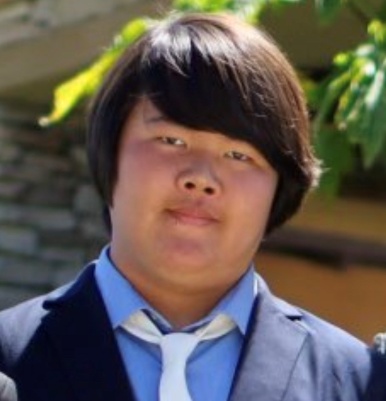

# Daniel Hwang's User Page



> A somewhat old picture of myself

## Introduction

My name is Daniel Hwang and I am a 2<sup>nd</sup> year **Computer Science** student at
the *University of California, San Diego*. I aspire to become a Software Engineer and hope to
utilize the information I have acquired from university.

Some of the programming languages I have experience with are:
* C
* C++
* Python
* Java

My best skills include:
1. Teamwork
2. Adaptability
3. Organization
4. Management

My current goals are:
- [x] Get into college
- [ ] Get an internship
- [ ] Become a millionaire 

Here is an example of some code I made recently:
```
print("Hello World")
```

## Extra Links

Link to my [Github profile](https://github.com/de-hwang)

Link to the [README file](README.md)